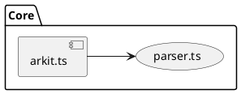
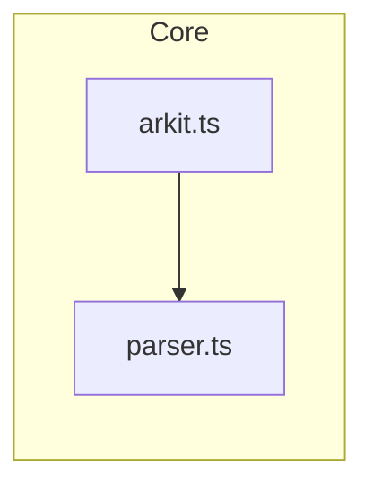
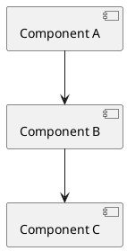
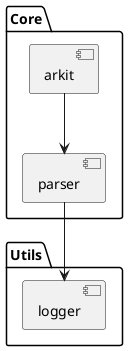
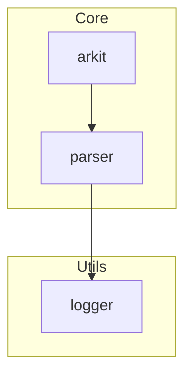

# Mermaid.js Migration Plan

## Executive Summary

This document outlines the feasibility and implementation strategy for migrating Arkit from PlantUML (Java-based) to Mermaid.js (pure JavaScript), eliminating the Java runtime dependency.

## Current Architecture

Arkit currently uses a two-stage rendering pipeline:

1. **Generation Stage**: Converts parsed code structure to PlantUML syntax (DSL)
2. **Rendering Stage**: Uses Java PlantUML + GraphViz to render diagrams

```
Code Analysis → PlantUML DSL → Java PlantUML → GraphViz → SVG/PNG
  (parser.ts)    (puml.ts)    (node-plantuml)  (WASM/sys)
```

### PlantUML Syntax Example



## Proposed Architecture

Replace PlantUML with Mermaid.js for pure JavaScript rendering:

```
Code Analysis → Mermaid DSL → Mermaid.js → SVG/PNG
  (parser.ts)    (mermaid.ts)  (pure JS)
```

## Node.js Alternatives Analysis

### 1. Mermaid.js ⭐ Recommended

**Pros:**
- ✅ 100% JavaScript - No Java required
- ✅ Runs in Node.js and browsers
- ✅ Active development (50k+ GitHub stars)
- ✅ Similar declarative syntax to PlantUML
- ✅ Multiple diagram types (flowchart, sequence, class, etc.)
- ✅ Built-in SVG/PNG export via `@mermaid-js/mermaid-cli`
- ✅ Good documentation and community support

**Cons:**
- ❌ Different syntax from PlantUML (breaking change)
- ❌ Slightly different visual style
- ❌ May lack some advanced PlantUML features
- ❌ Requires rewriting syntax generator

**Mermaid Syntax Example:**


### 2. vis-network

**Pros:**
- ✅ Pure JavaScript
- ✅ Highly customizable
- ✅ Good performance for large graphs

**Cons:**
- ❌ No DSL - requires programmatic graph building
- ❌ More complex API
- ❌ Steeper learning curve

### 3. Cytoscape.js

**Pros:**
- ✅ Pure JavaScript
- ✅ Excellent for complex network graphs
- ✅ Rich plugin ecosystem

**Cons:**
- ❌ No DSL - programmatic only
- ❌ Heavier library
- ❌ More oriented toward interactive graphs

### 4. D3.js

**Pros:**
- ✅ Maximum flexibility
- ✅ Industry standard for data visualization

**Cons:**
- ❌ Requires extensive custom rendering code
- ❌ Massive development effort
- ❌ Steep learning curve
- ❌ Overkill for static diagrams

## Recommended Solution: Mermaid.js

### Why Mermaid?

1. **Similar mental model**: Both use declarative DSL syntax
2. **Minimal dependency changes**: One npm package vs Java + GraphViz
3. **Better DX**: Faster installation, no system dependencies
4. **Modern ecosystem**: Active development, good tooling
5. **Future-proof**: JavaScript-based, easier to extend

## Implementation Plan

### Phase 1: Foundation (Week 1)

#### 1.1 Add Mermaid Dependencies
```bash
npm install mermaid @mermaid-js/mermaid-cli
```

#### 1.2 Create Mermaid Syntax Generator
- Create `src/mermaid.ts` based on `src/puml.ts`
- Map Arkit's component structure to Mermaid graph syntax
- Implement subgraph support for component grouping
- Handle styling and layout options

#### 1.3 Update Types
- Add `MermaidSchema` type definitions
- Update `OutputFormat` enum to include mermaid
- Add configuration options for Mermaid-specific settings

### Phase 2: Converter Rewrite (Week 2)

#### 2.1 Update Converter
- Modify `src/converter.ts` to support Mermaid rendering
- Implement Mermaid CLI integration for SVG/PNG export
- Keep PlantUML support initially (dual mode)
- Add backend selection logic

#### 2.2 Configuration Updates
- Add `renderer: 'plantuml' | 'mermaid'` option
- Update `schema.ts` with new configuration options
- Default to Mermaid for new users, PlantUML for existing configs

### Phase 3: Testing & Migration (Week 3)

#### 3.1 Update Tests
- Create new snapshot tests for Mermaid output
- Update existing tests to support both renderers
- Test with real-world codebases (Express, React, etc.)

#### 3.2 Documentation
- Update README.md with installation instructions
- Create migration guide for existing users
- Update examples with Mermaid syntax
- Document differences between PlantUML and Mermaid

### Phase 4: Deprecation & Release (Week 4)

#### 4.1 Deprecation Path
- Release v2.0 with both renderers (Mermaid default)
- Add deprecation warnings for PlantUML
- Provide automatic migration tool
- Support both for 6-12 months

#### 4.2 Release Strategy
- v2.0.0: Mermaid as default, PlantUML optional
- v2.x.x: Bug fixes and feature parity
- v3.0.0: Remove PlantUML support (optional)

## Code Changes Required

### Files to Create
- `src/mermaid.ts` - Mermaid syntax generator (~250 lines)
- `test/mermaid.test.ts` - Mermaid-specific tests
- `MIGRATION_GUIDE.md` - User migration documentation

### Files to Modify
- `src/converter.ts` - Add Mermaid rendering support
- `src/types.ts` - Add Mermaid type definitions
- `src/schema.ts` - Add renderer configuration
- `src/cli.ts` - Add `--renderer` option
- `src/arkit.ts` - Update main orchestration logic
- `README.md` - Update installation instructions
- `package.json` - Update dependencies

### Files to Keep (Backward Compatibility)
- `src/puml.ts` - Keep for legacy support
- `src/node-plantuml.d.ts` - Keep for legacy support

## Syntax Mapping: PlantUML → Mermaid

### Component Mapping

| PlantUML | Mermaid | Notes |
|----------|---------|-------|
| `[Component]` | `A[Component]` | Rectangle |
| `(Module)` | `A(Module)` | Rounded rectangle |
| `package "Name" {}` | `subgraph Name` | Grouping |
| `-->` | `-->` | Same |
| `..>` | `-.->` | Dashed arrow |

### Layout Direction

| PlantUML | Mermaid |
|----------|---------|
| `left to right direction` | `graph LR` |
| `top to bottom direction` | `graph TD` |

### Styling

PlantUML uses `skinparam`, Mermaid uses `%%` directives or CSS classes.

## Dependency Changes

### Current Dependencies
```json
{
  "@hpcc-js/wasm-graphviz": "^1.16.0",
  "node-plantuml": "^0.9.0"
}
```

### Proposed Dependencies
```json
{
  "mermaid": "^10.6.0",
  "@mermaid-js/mermaid-cli": "^10.6.0"
}
```

### Size Comparison
- PlantUML: Java (~15MB) + node-plantuml (~1MB) + @hpcc-js/wasm-graphviz (~20MB) = **~36MB**
- Mermaid: mermaid (~5MB) + mermaid-cli (~15MB with Puppeteer) = **~20MB**

**Net savings: ~16MB + no Java installation required**

## Breaking Changes

### For Users

1. **Syntax Change**: `.puml` files will no longer be compatible
2. **Visual Differences**: Diagram style and layout will change
3. **Configuration**: New configuration options required
4. **System Dependencies**: No more Java requirement (positive breaking change)

### Mitigation Strategy

1. **Dual Mode**: Support both renderers in v2.x
2. **Auto-detection**: Detect legacy configs and use PlantUML
3. **Migration Tool**: Provide CLI tool to convert configs
4. **Clear Documentation**: Comprehensive migration guide
5. **Gradual Rollout**: Beta period with both options

## Benefits Analysis

### User Benefits
- ✅ **No Java required** - Easier installation and setup
- ✅ **Faster installation** - Smaller npm packages
- ✅ **Better cross-platform** - No system dependencies
- ✅ **Faster CI/CD** - No Java installation step
- ✅ **Modern tooling** - JavaScript ecosystem integration

### Developer Benefits
- ✅ **Easier debugging** - Pure JavaScript stack
- ✅ **Better testability** - No Java process spawning
- ✅ **Faster iteration** - No compile step
- ✅ **Easier contributions** - Lower barrier to entry
- ✅ **Future extensibility** - JavaScript ecosystem

### Performance Impact
- **Rendering speed**: Likely similar or slightly faster
- **Memory usage**: Lower (no Java heap)
- **Startup time**: Faster (no JVM startup)

## Risks & Challenges

### Technical Risks
1. **Feature Parity**: Mermaid may lack some PlantUML features
2. **Visual Quality**: Different rendering style may not suit all users
3. **Layout Algorithm**: Different automatic layout behavior
4. **Edge Cases**: Complex diagrams may render differently

### Mitigation
1. **Feature audit**: Document all used PlantUML features
2. **Beta testing**: Extensive testing with real codebases
3. **Fallback option**: Keep PlantUML available for edge cases
4. **User feedback**: Early beta release for community feedback

### Business Risks
1. **User churn**: Breaking changes may frustrate users
2. **Support burden**: Maintaining two renderers temporarily
3. **Documentation**: Significant doc updates required

### Mitigation
1. **Clear communication**: Blog post, changelog, migration guide
2. **Gradual transition**: Long deprecation period
3. **Support tooling**: Automated migration scripts

## Proof of Concept

### Minimal PoC Scope
1. Create basic `src/mermaid.ts` with simple graph generation
2. Add Mermaid rendering to `src/converter.ts`
3. Generate one example diagram (e.g., Express.js)
4. Compare visual output with PlantUML version

### Success Criteria
- ✅ Successfully generates valid Mermaid syntax
- ✅ Renders to SVG/PNG without errors
- ✅ Diagram is readable and represents architecture accurately
- ✅ No Java dependency required
- ✅ Performance is comparable or better

## Timeline Estimate

| Phase | Duration | Effort |
|-------|----------|--------|
| Research & PoC | 3-5 days | Medium |
| Core Implementation | 2 weeks | High |
| Testing & Refinement | 1 week | Medium |
| Documentation | 3-5 days | Medium |
| Beta Testing | 2 weeks | Low |
| Final Release | 1 week | Low |
| **Total** | **6-8 weeks** | **Medium-High** |

## Recommendation

### For Immediate Action
**Maintain current PlantUML approach** because:
1. Arkit is mature with established user base
2. PlantUML produces high-quality professional diagrams
3. Java dependency is well-documented and one-time setup
4. Migration would be a significant breaking change

### For Future Consideration (v2.0+)
**Evaluate Mermaid.js migration** if:
1. User feedback indicates Java is a major pain point
2. Community shows strong interest in JavaScript-only solution
3. Mermaid.js feature set reaches full parity
4. Development resources available for 6-8 week project

### Hybrid Approach (Best of Both Worlds)
**Support both renderers** with:
- Mermaid as default for new users (easier setup)
- PlantUML as option for power users (more features)
- Configuration flag: `renderer: 'mermaid' | 'plantuml'`
- This provides flexibility while moving ecosystem forward

## Appendix A: Mermaid.js Resources

- **Official Site**: https://mermaid.js.org/
- **GitHub**: https://github.com/mermaid-js/mermaid
- **Live Editor**: https://mermaid.live/
- **CLI Tool**: https://github.com/mermaid-js/mermaid-cli
- **npm Package**: https://www.npmjs.com/package/mermaid

## Appendix B: Syntax Comparison Examples

### Simple Component Diagram

**PlantUML:**


**Mermaid:**


### Grouped Components

**PlantUML:**


**Mermaid:**


## Appendix C: Implementation Pseudocode

### Mermaid Generator Skeleton

```typescript
// src/mermaid.ts
export class Mermaid {
  from(output: OutputSchema, layers: Layers): string {
    const mermaid = ["graph " + this.getDirection(output)];
    
    for (const [layer, components] of layers.entries()) {
      mermaid.push(this.generateSubgraph(layer, components));
    }
    
    mermaid.push(this.generateRelationships(components));
    
    return mermaid.join("\n");
  }
  
  private getDirection(output: OutputSchema): string {
    return output.direction === "horizontal" ? "LR" : "TD";
  }
  
  private generateSubgraph(layer: string, components: Set<Component>): string {
    // Convert layer and components to Mermaid subgraph syntax
  }
  
  private generateRelationships(components: Component[]): string {
    // Convert component imports to Mermaid arrows
  }
}
```

---

**Document Version**: 1.0  
**Last Updated**: December 1, 2025  
**Status**: Draft for Discussion
